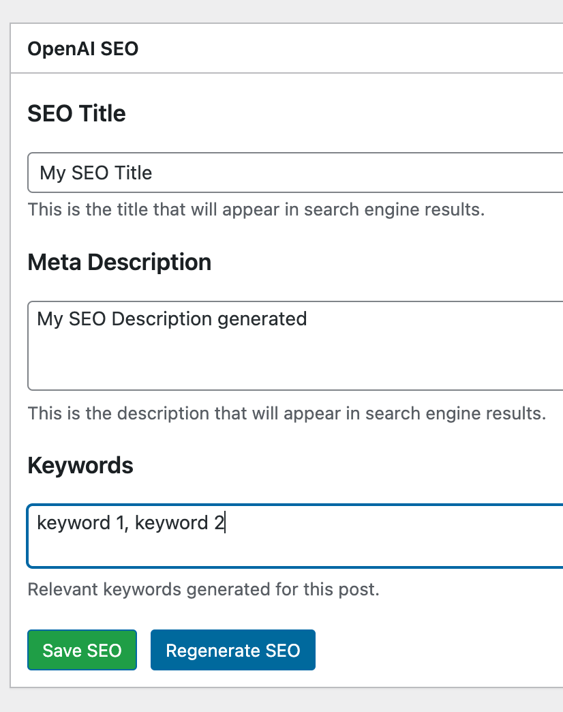
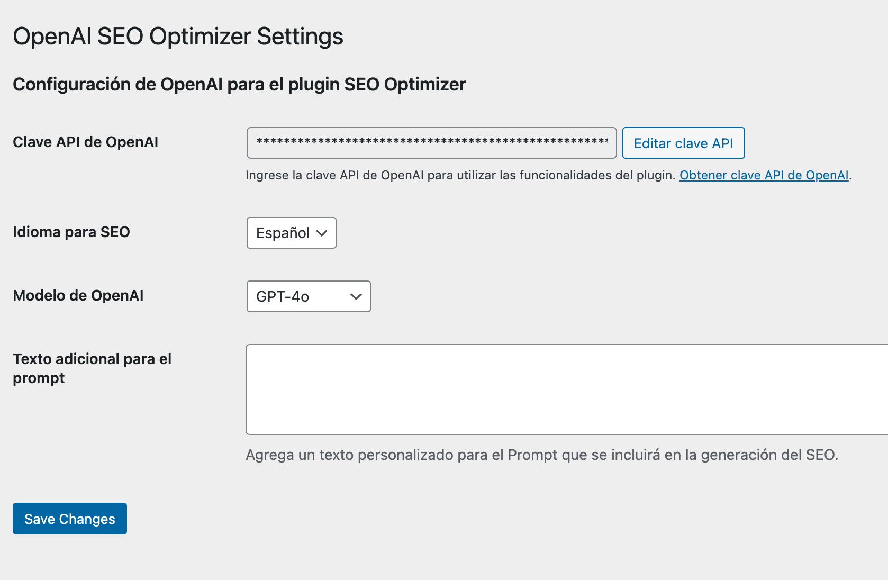

=== OpenAI SEO Optimizer ===
Contributors: Dagoberto Medina  
Tags: SEO, OpenAI, WordPress, optimization, meta box, Classic Editor  
Requires at least: 5.0  
Tested up to: 6.6  
Requires PHP: 7.2  
Stable tag: 1.0  
License: GPLv2 or later  
License URI: https://www.gnu.org/licenses/gpl-2.0.html

**Automate SEO optimization for your posts, pages, and custom post types using OpenAI's API.**

== Description ==

**OpenAI SEO Optimizer** is a WordPress plugin that utilizes the OpenAI API to generate SEO-friendly titles, meta descriptions, and keywords for posts, pages, and custom post types (woocommerce products). It also allows manual editing of these fields and gives flexibility for fine-tuning prompts.

**Features:**
- Automated SEO content generation for posts and pages
- Customizable OpenAI prompts
- Option for manual editing of SEO metadata
- Automatically adds meta tags (Open Graph and canonical links) to the frontend
- Support for GPT-4o and GPT-4o-mini models
- Seamless integration with WordPress meta boxes

**Meta Tags Added:**
- `<meta name="description">`
- `<meta name="keywords">`
- `<link rel="canonical">`
- `<meta property="og:title">`
- `<meta property="og:description">`
- `<meta property="og:url">`
- `<meta property="og:site_name">`
- `<meta property="og:type">`
- `<meta property="og:locale">`
- `<meta name="author">`

**Requirements:**
- OpenAI Account: You need an OpenAI account and a valid API key to use this plugin.
- WordPress 5.0 or higher
- Optionally, you may need to install the [Classic Editor](https://wordpress.org/plugins/classic-editor/) plugin if you want to ensure compatibility with the traditional post editor.

== Installation ==

1. **Download the Plugin:** Download the ZIP file from the repository.
2. **Upload and Install:** Go to `Plugins > Add New` in your WordPress admin panel, select `Upload Plugin`, choose the ZIP file, and click `Install Now`.
3. **Activate the Plugin:** Once installed, activate the plugin from the plugins list.
4. **Configure your API Key:** Go to `Settings > OpenAI SEO Optimizer` and enter your OpenAI API key.

**Important Notes:**
- If you are using the Block Editor (Gutenberg), you may want to install the [Classic Editor](https://wordpress.org/plugins/classic-editor/) plugin to ensure compatibility with this plugin’s meta box features.
- When editing a post, product, or custom post type, make sure that **OpenAI SEO** is selected under **Screen Options** to display the meta box.

== Usage ==

1. **Upload the Plugin:** Upload the ZIP file from the plugin to your WordPress site.
2. **Configure the API Key:** Go to `Settings > OpenAI SEO Optimizer` or directly to `wp-admin/options-general.php?page=openai-seo-optimizer` and paste the API key you generated from the OpenAI dashboard.
3. **Add or Edit a Post:** When adding or editing a post, page, or custom post type, a new meta box will appear allowing you to generate SEO content or manually edit it.
4. **Generate SEO Automatically or Manually:**
   - **Automatic Generation:** Click "Generate SEO" in the meta box to have OpenAI create SEO-optimized content for you.
   - **Manual Editing:** You can manually edit the SEO title, meta description, and keywords if needed.

== Frequently Asked Questions ==

= What does this plugin do? =
This plugin automates the generation of SEO metadata for WordPress posts, pages, and custom post types using OpenAI’s API, allowing you to either automatically generate or manually edit SEO titles, descriptions, and keywords.

= Do I need the Classic Editor plugin? =
While not strictly necessary, installing the [Classic Editor](https://wordpress.org/plugins/classic-editor/) may improve the user experience by providing seamless compatibility with the traditional meta box.

= I can't see the OpenAI SEO meta box when editing posts. What should I do? =
Check the **Screen Options** (located at the top-right corner of the editor page) and ensure that **OpenAI SEO** is selected to display the meta box.

= How do I get an OpenAI API key? =
You can get an API key by creating an account at [OpenAI's website](https://platform.openai.com/account/api-keys).

= What are the costs associated with using this plugin? =
The costs depend on your OpenAI usage. With $1, you can process between 70-100 posts using GPT-4o or up to 200 posts using GPT-4o-mini.

== Screenshots ==

1. **SEO Meta Box:** This screenshot shows the SEO meta box on the post edit screen with auto-generated values.
   

2. **API Key Settings:** This screenshot shows where you can configure your OpenAI API key.
   

3. **Screen Options:** This screenshot shows how to enable the OpenAI SEO meta box in the Screen Options of the post editor.
   
== Changelog ==

= 1.0 =
* Initial release of OpenAI SEO Optimizer.

== Upgrade Notice ==

= 1.0 =
Initial release with automated SEO generation and manual editing options.

== License ==

This plugin is licensed under the GPLv2 or later.

## TODO
- [ ] Improve security based on results from [Plugin Check](https://wordpress.org/plugins/plugin-check/).
- [ ] Add support for additional languages in SEO prompt customization.
- [ ] Enhance the admin interface for better user experience.
- [ ] Translate the plugin into multiple languages.
